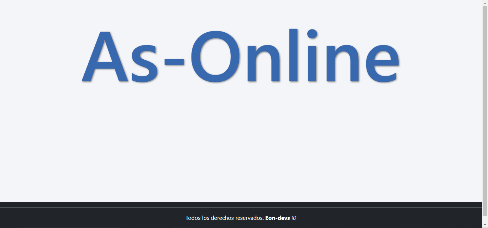
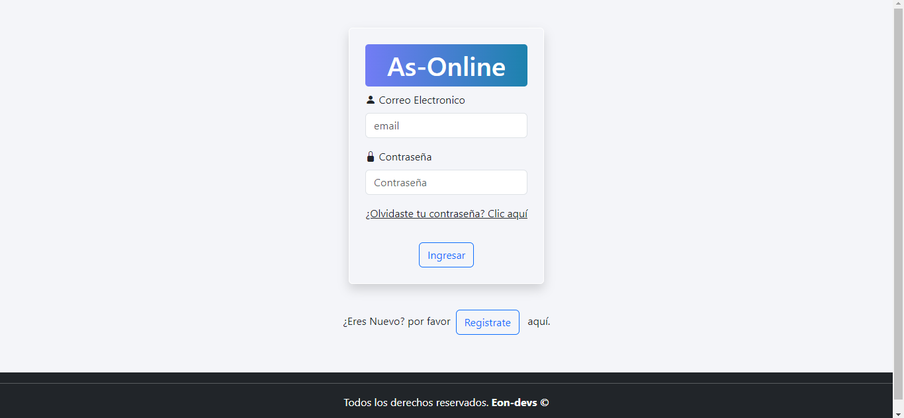
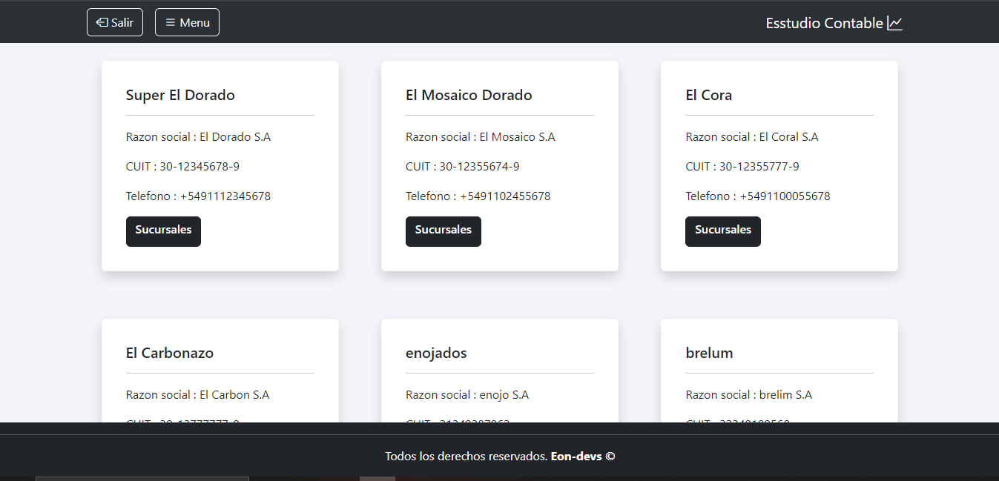
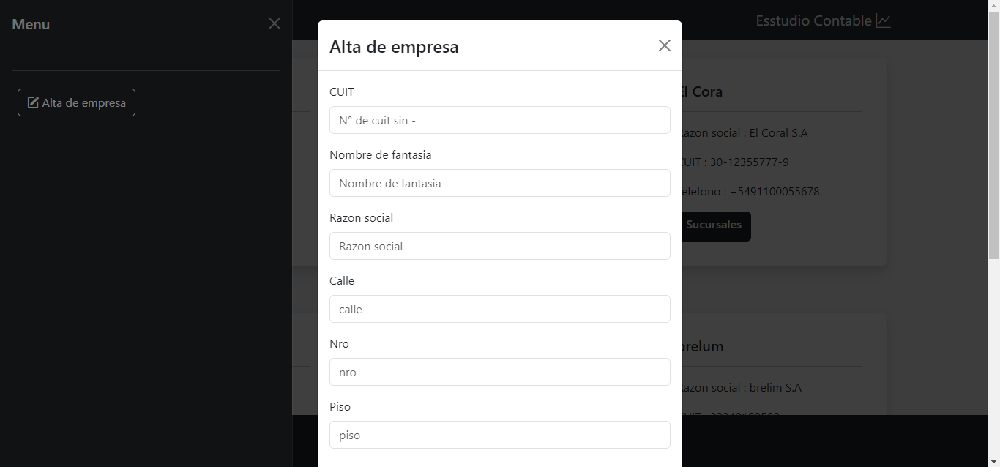
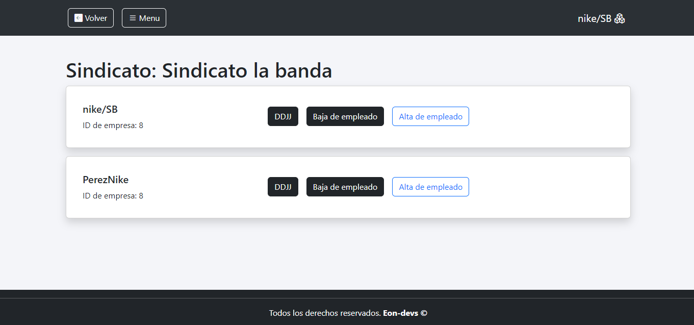
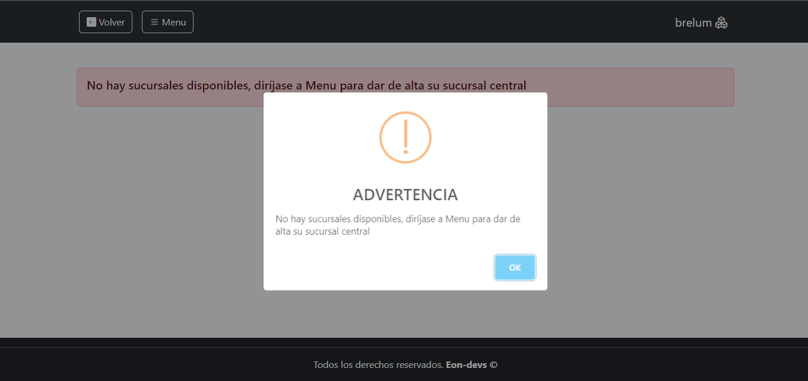
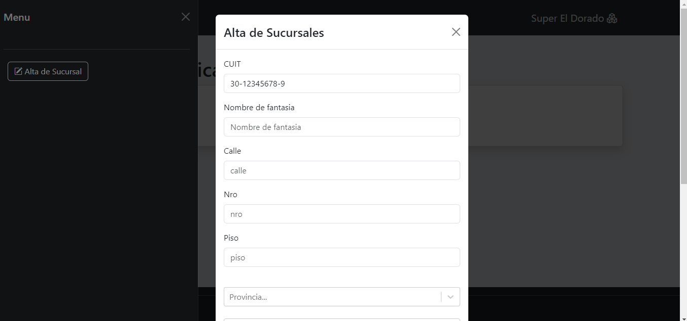
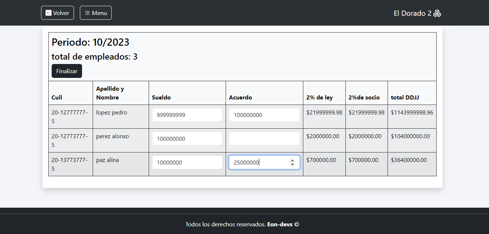
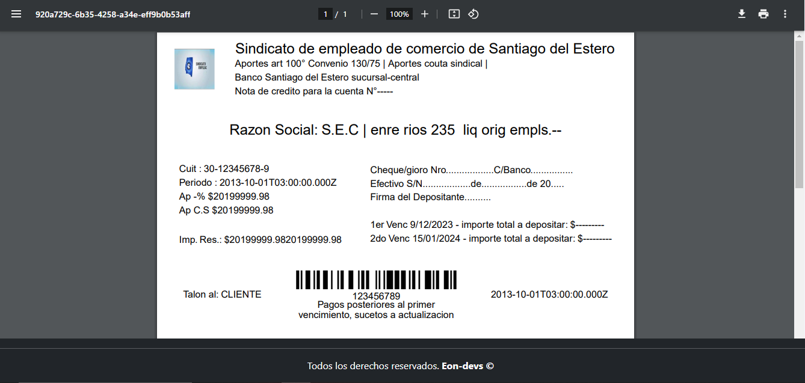

# As-Online  - SPA (Deployado y Responsivo)

  

  

  

  

  

  

  

  

  

► Deploy Frontend: https://as-online-front-demo.vercel.app/

Tecnologías necesarias:
* React
* Vite
* Node
* Express
* axios
* PostgreSQL
* Sequelize
* bwip-js

IMPORTANTE: Se utilizo Bootstrap, react-bootstrap, sweetalert, animate.css y sus correspondientes estilos, ademas de CSS puro.

# Descripción
Esta es una DEMO de una aplicación destinada a estudios contables, para realizar aportes sindicales,
registrando las liquidaciones de sueldos a los empleados de las diferentes sucursales de una empresas 
y empitiendo la factura en un formato pdf. La aplicacion , tambien cuenta con las funciones de dar de alta
empresas, sucursales, empleados 

* Iniciar sesion/Login donde el estudio contable puede autenticarse
* Registro donde se puede dar de alta a un estudio contable
* Pagina de menu de empresas, con cards de todas las empresas con las que trabaja el estudio contable
 con opciones de entrar a ver las sucursales y dar de alta a nuevas empresas
* Pagina de menu de sucursales, con el sindicato al que corresponden y las opciones de realizar las declaraciones juradas (DDJJ),
 dar de alta sucursales nuevas y las de dar de alta y de baja a un empleado de la sucursal seleccionada
* Declaraciones página donde lista a los empleados para registrar la liquidacion de su sueldo,
 con el respectivo calculo que le corresponde al sindicato al que pertenece 
* PDF generado con el total y su respectivo codigo de barra

#### Frontend

Aplicación de React
__Pagina inicial__: 
Landing page con:
- [ ] Login donde se ingresan los siguientes datos:
     * Email
     * Contraseña
- [ ] Restablecer contraseña envia un email al correo por si se olvida la contraseña y desea restablecerla mediante el uso de emailjs

__Pagina Registro__:
- [ ] Formulario para alta de usuario con los siguientes datos:
       
     * Nombre del estudio contable
     * Correo electronico
     * Contraseña (con metodo de encriptacion)
     * Telefono
     * Domicilio
     * Cuit
     * Localidad
     
__Pagina Menu De Empresas__:
- [ ] Barra de navegacion lateral con el siguiente boton:
     * Alta de empresas
- [ ] Barra de navegacion con los siguientes botones:
     * Perfil de la empresa
     * Menu lateral
     * Salir
     
- [ ] Formulario para dar de alta una empresa, que pide los siguientes datos:
* Nombre del estudio contable
     * Cuit
     * Nombre de fantasia
     * Razon social
     * Calle
     * Nro
     * Piso
     * Provincia
     * Codigo postal
     * Telefono
     * Correo electronico de la empresa
- [ ] Generacion de una nueva card de empresa en el menu
- [ ] Card de empresa  con el boton:
     * Sucursales

__Pagina Menu De Sucursales__:
- [ ] Barra de navegacion con los siguientes botones:
     * Perfil de la Sucursal
     * Menu lateral
     * Volver

- [ ] Barra de navegacion lateral con el siguiente boton:
     * Alta de Sucural

- [ ] Formulario para dar de alta una Sucursal, que pide los siguientes datos:
     * Nombre del estudio contable
     * Cuit
     * Nombre de fantasia
     * Calle
     * Nro
     * Piso
     * Provincia
     * Codigo postal
     * Telefono
     * Correo electronico de la sucursal
- [ ] Generacion de una card de la nueva sucursal en el  menu
- [ ] Card de Sucursal con los botones:
     * DDJJ (realiza una declaracion jurada registrando de las liquidacion de los sueldos de los empleados)
     * Baja de empleado
     * Alta de empleado
- [ ] Formulario para dar de alta de empleados, que pide los siguientes datos:
     * DNI
     * CUIL
     * Nombre
     * Apellido
     * Piso
     * Provincia
     * Codigo postal
     * Telefono
     * Correo electronico
     * Localidad

   
__Paginas De Declaracion Jurada (DDJJ)__:
 - [ ] Pagina que realiza la declaracion jurada de sueldos y sus aportes, estos calculados automaticamente y tiene los siguientes datos de los empleados:
     * CUIL
     * Apellido y Nombre
     * Sueldo
     * Acuerdo
     * 2% de ley
     * 2% de socio
     * Total DDJJ

- [ ] Barra de navegacion lateral con el siguiente boton:
     * Alta de empleados

   
__Pagina De PDF__:
 - [ ] Pagina que genera la boleta PDF con los siguientes datos:
     * Sindicato
     * Banco
     * CUIT
     * Periodo
     * AP (aporte de ley)
     * APCS (aporte de socio)
     * Imp.Res (El total de la boleta)
     * Codigo de barra generado

 IMPORTANTE: Esta es solo una Demo realizada para el Sindicato de empleados de comercio, la vercion final tiene mas funciones a realizr!    
